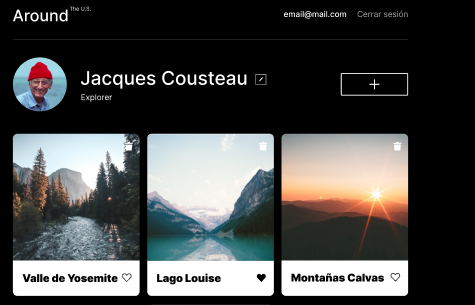
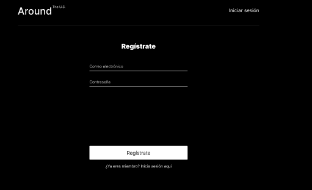
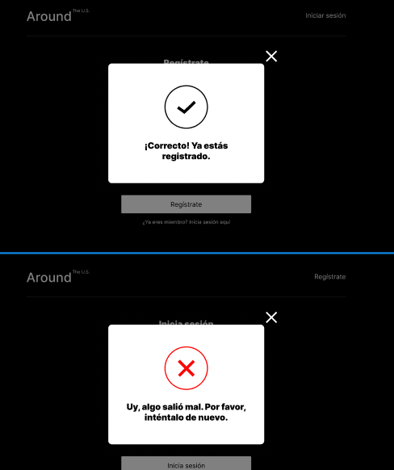
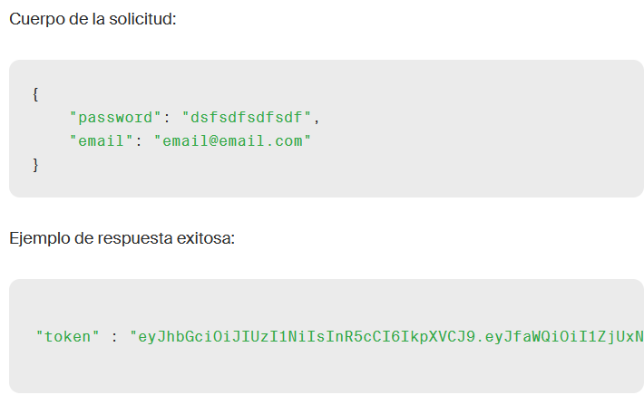

# Tripleten web_project_around_react_auth

---

## :astonished: De que trata?

### Se trabajará en la parte de autorización, y autenticación del lado del frontend para el proyecto "Alrededor de Usa", mediante la creación de nuevos componentes con React que permitirán el manejo de rutas, y redirecciones, al mismo tiempo será el primer proyecto que se trabajará con vite.

### imágenes del resultado final:

---

## :interrobang: Que se aprendió en está etapa?

1. ### Crear dos nuevas rutas:

### /signup: registro de usuarios.

### /signin: autorización de usuarios.

2. ### Crear los siguentes componentes para controlar el acceso de ususarios:

### Login(componente para autorización), Register(crear las variables de registro), ProtectedRoute(Los usuarios no puedan entrar a una ruta protegida), infoToolTip(ventana modal que indica si el acceso fue exitoso o no)

### En caso de que aparezca un usuario no autorizado o ya registrado, este sera reenviado a la página principal "Login"

3. ### Analizar y verificar que los endpoints "/signup y /signup" funcionan correctamente bajo las siguientes directrices:

### Agregar a las solicitudes un encabezado Authorization: Bearer {token}, utilizando el token recibido por la solicitud de autenticación del usuario.

### Hacer el modulo "auth" que contenga los metodos correspondientes para poder enviar, y recibir los datos de usuario (método POST), dependiendo de la respuesta aparecerá un mensaje de error, o en su caso, los datos del usuario con su respectivo token.

---

## Link del proyecto:

---

## Tecnologías principales utilizadas:

&nbsp;
&nbsp;
